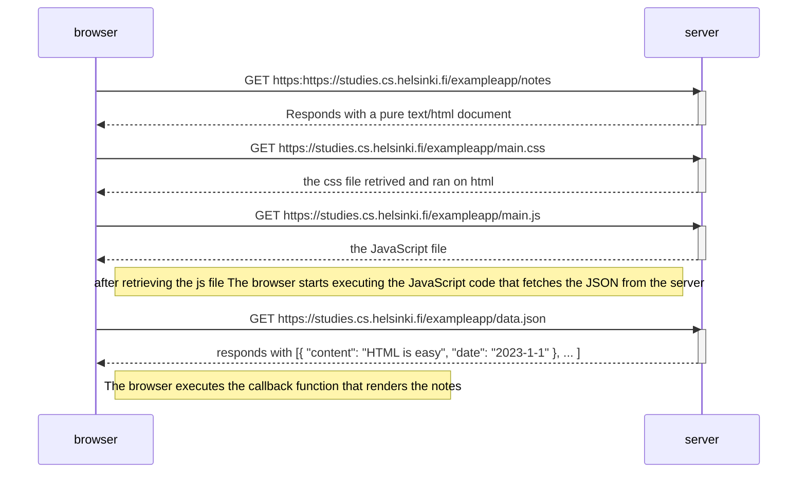

```mermaid
sequenceDiagram
	participant browser
	participant server
	
	browser->>server: GET https:https://studies.cs.helsinki.fi/exampleapp/notes
	activate server
	server-->>browser: Responds with a pure text/html document
	deactivate server

	browser->>server: GET https://studies.cs.helsinki.fi/exampleapp/main.css
    	activate server
        server-->>browser: the css file retrived and ran on html
    	deactivate server

    	browser->>server: GET https://studies.cs.helsinki.fi/exampleapp/main.js
    	activate server
    	server-->>browser: the JavaScript file
    	deactivate server

    	Note right of browser: after retrieving the js file The browser starts executing the JavaScript code that fetches the JSON from the server

    	browser->>server: GET https://studies.cs.helsinki.fi/exampleapp/data.json
    	activate server
    	server-->>browser: responds with [{ "content": "HTML is easy", "date": "2023-1-1" }, ... ]
    	deactivate server

    	Note right of browser: The browser executes the callback function that renders the notes
```
