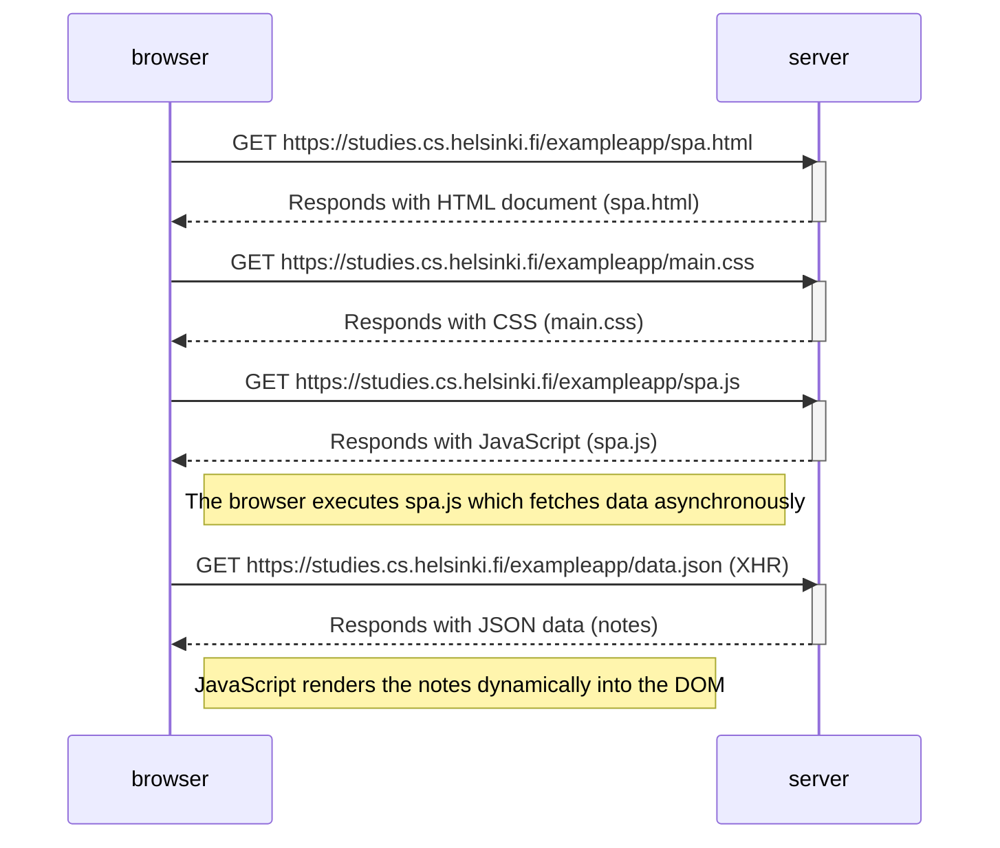

```mermaid
sequenceDiagram
    participant browser
    participant server

    browser->>server: GET https://studies.cs.helsinki.fi/exampleapp/spa.html
    activate server
    server-->>browser: Responds with HTML document (spa.html)
    deactivate server

    browser->>server: GET https://studies.cs.helsinki.fi/exampleapp/main.css
    activate server
    server-->>browser: Responds with CSS (main.css)
    deactivate server

    browser->>server: GET https://studies.cs.helsinki.fi/exampleapp/spa.js
    activate server
    server-->>browser: Responds with JavaScript (spa.js)
    deactivate server

    Note right of browser: The browser executes spa.js which fetches data asynchronously

    browser->>server: GET https://studies.cs.helsinki.fi/exampleapp/data.json (XHR)
    activate server
    server-->>browser: Responds with JSON data (notes)
    deactivate server

    Note right of browser: JavaScript renders the notes dynamically into the DOM
```
