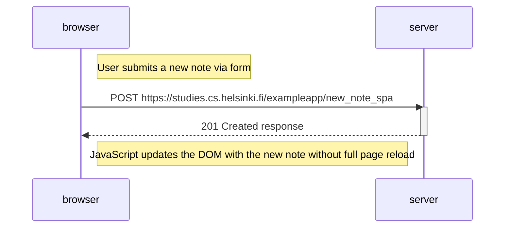

```mermaid
sequenceDiagram
    participant browser
    participant server

    Note right of browser: User submits a new note via form

    browser->>server: POST https://studies.cs.helsinki.fi/exampleapp/new_note_spa 
    activate server
    server-->>browser: 201 Created response
    deactivate server

    Note right of browser: JavaScript updates the DOM with the new note without full page reload
```
